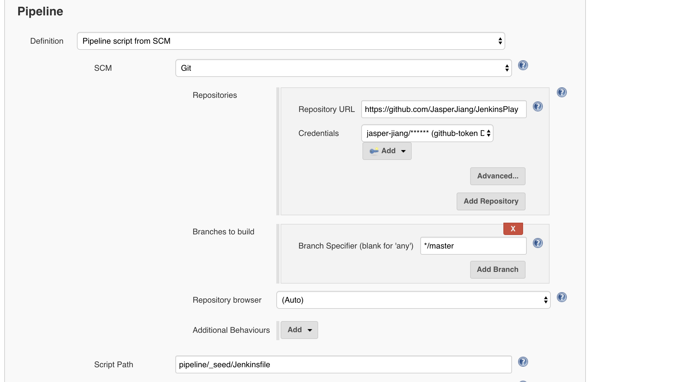

# PipeLine & DSL

[Jenkins PipeLine 文档](https://jenkins.io/doc/book/pipeline/)

## Hello Word Sample

```text
Jenkinsfile (Declarative Pipeline)
pipeline {
    agent { docker 'maven:3.3.3' }
    stages {
        stage('build') {
            steps {
                sh 'mvn --version'
            }
        }
    }
}
```

## Agent

[Agent Syntax Document](https://jenkins.io/doc/book/pipeline/syntax/#agent)  

### Agents Level

* Top Level Agents
* Stage Agents

### Agents Types

* any
* none
* label
* node
* docker
* dockerfile
* kubernetes

## Config Pipeline Job SCM


